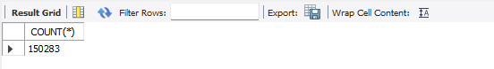

# Sales Insights Data Analytics Project.

Using the data analytics life cycle, going step by step for solving the business problem, these steps are:

1 - `Understanding Business Problem.`                                                                                                                           
2 - `Data Collecing and Preperation.`                                                                                                                              
3 - `Data Processing.`                                                                                                                                             
4 - `Data Analysis, Cleaning and ETL.`                                                                                                                              
5 - `Building and Sharing Dashboard.`                                                                                                                               
6 - `Stakeholders Feedback and Analysis Profit.`                                                                                                                     

### 1 - Understanding Business Problem.

A Hardware Company in India which supplies computer hardware and peropherals is facing issues with tracking their sales and getting insights (Complete Picture) from the of market Computer Hardware which is growing dramatically.

### 1.1 - Stakeholders Expectations and Business Objectives.

After examinings the overall scope of the work, business objectives and information, the stakeholders are seeking a simple, understandable insights, specifically a dashboard which supports the latest insights from sales revenue and so on, so that they can take actual data driven descision based on this dashboard and so they can increase the sales of the company.

### 2 - Data Collecing and Preperation.

The data required for the analsis is available at mysql database server that is owned by the company, this database has all sales transactions, customers, products and markets information, the initial appropriate method for the analysis is using SQL queries.

### 3 - Data Processing.

For the data understanding part, using sql to determine data availability and explore data and it's characteristics, for this part we will strat using SQL Queries Statements:

`SELECT COUNT(*) FROM sales.transactions;`

  
`SELECT * FROM sales.customers LIMIT 5;`
 

 
`SELECT COUNT(*) FROM sales.customers;`

`SELECT * FROM sales.transactions WHERE market_code = 'Mark004';`

`SELECT distinct product_code FROM sales.transactions WHERE market_code = 'Mark001';`

`SELECT * FROM sales.transactions where currency = 'USD';`

  
  
 <b> Click for more SQL Data Analysis Queries Statements! </b> 

  
    
  
`SELECT sales.transactions.*, sales.date.* FROM sales.transactions INNER JOIN sales.date ON sales.transactions.order_date = sales.date.date where sales.date.year = 2020;`

`SELECT SUM(sales.transactions.sales_amount) FROM sales.transactions INNER JOIN sales.date ON sales.transactions.order_date=sales.date.date where sales.date.year=2020 and sales.transactions.currency="INR\r" or sales.transactions.currency="USD\r";`

`SELECT SUM(sales.transactions.sales_amount) FROM sales.transactions INNER JOIN sales.date ON sales.transactions.order_date = sales.date.date WHERE sales.date.year = 2020 AND sales.date.month_name = 'January' and (sales.transactions.currency="INR\r" or sales.transactions.currency="USD\r");`

`SELECT SUM(sales.transactions.sales_amount) FROM sales.transactions INNER JOIN sales.date ON sales.transactions.order_date = sales.date.date WHERE sales.date.year = 2020 AND sales.date.month_name = 'January' and (sales.transactions.currency="INR\r" or sales.transactions.currency="USD\r") AND sales.transactions.market_code = 'Mark001';`

## 4 - Data Analysis, Cleaning and ETL.

Start by plugging SQL Databse to MS Power BI, this process is also known as data munging or data wrangling, As appear from the SQL Queries the data is messy and contains some inconsistent values as `sales_amount` contains values in both `USD` and `INR` and these values need to be transformed to get the right results from the analysis.

Data Model and Star Schema as shown in Power BI:

  

  Start The ETL and Data Cleaning Process using `Power Query` to `connect`, `prepare` and `transform` our data, and the result of using Power Query will be the following:

   * Filtering the markets that only located in India.
   * Filtering all the `sales_amount` less than `1`.

